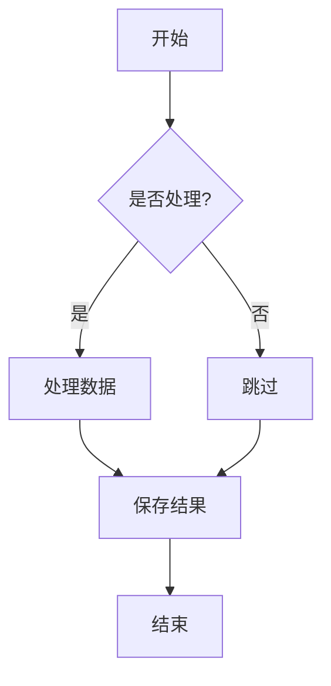
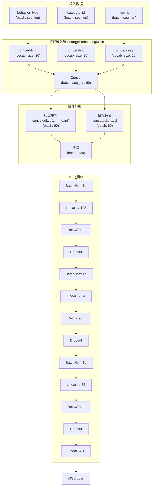
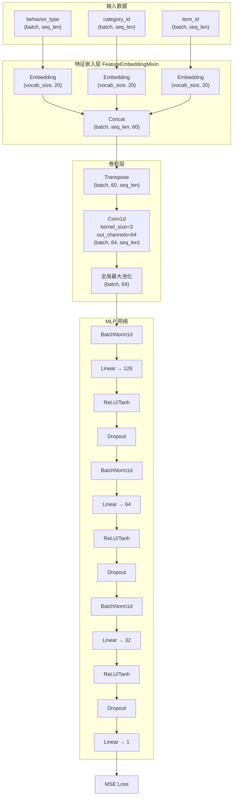
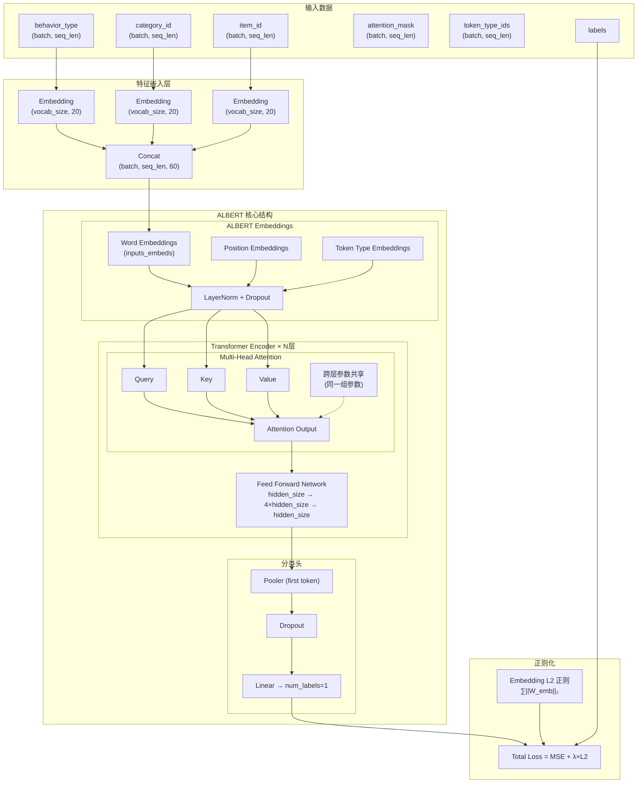
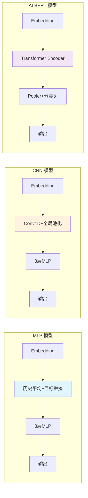

# Claude Conversation Log

Session ID: 25815f10-07e9-4ca6-a48a-c852a84cd6bf
Date: 2026-04-22 18:30:51

---

## 👤 User

你能显示mermaid预览吗？

---

## 🤖 Claude

是的，我可以生成 mermaid 图表代码！在 VSCode 中，如果你安装了支持 mermaid 的扩展（如 "Markdown Preview Mermaid Support"），mermaid 代码块可以在预览中渲染。

让我给你展示一个示例：

如果你需要在项目中创建特定的图表（如流程图、时序图、类图等），我可以帮你生成相应的 mermaid 代码。你想要创建什么类型的图表呢？

常见的 mermaid 图表类型包括：
- **流程图** (`graph`): 展示流程和决策
- **时序图** (`sequenceDiagram`): 展示对象间的交互
- **类图** (`classDiagram`): 展示类结构
- **状态图** (`stateDiagram`): 展示状态转换
- **甘特图** (`gantt`): 展示项目时间线

---

## 👤 User

见 modeling_*.py 我需要模型结构图

---

## 🤖 Claude

我来查找并分析你的模型文件，然后生成模型结构图。

---

## 🤖 Claude

让我在项目根目录搜索你的模型文件。

---

## 🤖 Claude

找到了三个模型文件，让我读取它们来生成结构图。

---

## 🤖 Claude

现在我还需要查看 `common.py` 文件来了解共享的组件结构。

---

## 🤖 Claude

现在我已经了解了所有模型的结构，让我为你生成三个模型的 mermaid 结构图。

## 模型结构图

### 1. MLP 模型结构

### 2. CNN 模型结构

### 3. ALBERT 推荐模型结构

### 三种模型对比总结

---

**说明：**

1. **MLP 模型**：最简单的基线模型，通过对历史序列取平均，与目标特征拼接后通过 MLP 预测
2. **CNN 模型**：使用 1D 卷积捕获局部模式，全局最大池化提取显著特征
3. **ALBERT 模型**：利用 Transformer 的注意力机制建模序列依赖关系，支持跨层参数共享

所有模型共享：
- `FeatureEmbeddingMixin`：特征嵌入层
- 输入特征：`behavior_type`、`category_id`、`item_id`
- 输出：回归预测（MSE Loss）

---

